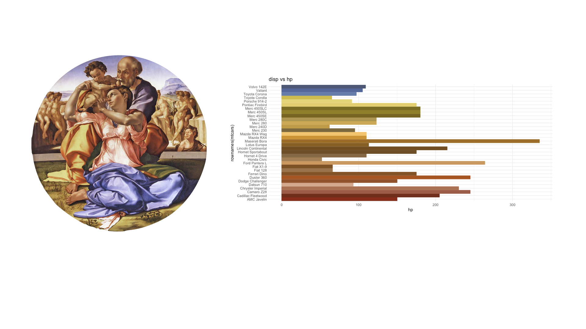

# paletteR

PaletteR is an R package that is able to draw an optimised palette from a custom image. The palette is obtained by applying statitical learning to the image provided and optimising the distribution of colours.

More on the math behind the package can be found at:

http://www.milanor.net/blog/build-color-palette-from-image-with-paletter/

## example

Tondo Doni, Michelangelo Buonarroti, 1503-1504



## Installation

The package is currently only on Github. You can install it as follows:

```
devtools::install_github("AndreaCirilloAC/paletter")
```

## usage
```
image_path <- "path_to_your_image"
colours_vector <- create_palette(image_path = image_path,
number_of_colors =32,
type_of_variable = “categorical")

ggplot(data = mtcars, aes(x = rownames(mtcars),y = hp,color = rownames(mtcars),
                          fill = rownames(mtcars))) +
  geom_bar(stat = 'identity') +
  scale_color_manual(values = colours_vector) +
  scale_fill_manual(values=colours_vector)+
  theme_minimal() +
  guides(size = FALSE) +
  theme(legend.position = "bottom") +
  labs(title = "disp vs hp")+
  coord_flip()

```
